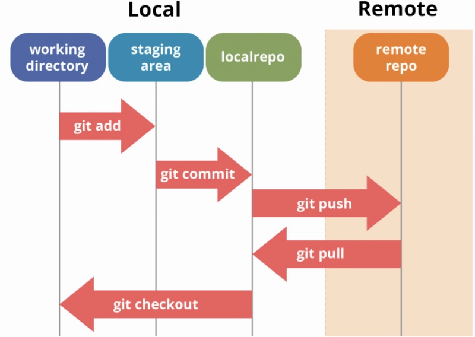

# Git Lab 2 

This repository demonstrates basic Git operations including branches, merge, tags, and workflow.

---

## Project Files

- `README.md` – this file  
- `dev.txt` – file in dev branch  
- `test.txt` – file in test branch  
- `git-workflow.png` – diagram illustrating repository, commit, push, pull workflow

---

## Git Workflow

This diagram explains the basic Git workflow including repository, commit, push and pull.

---

## Questions & Answers

**1. How to remove branches locally and remotely?**  
- Locally: `git branch -d branch-name`  
- Remotely: `git push origin --delete branch-name`

**2. How to checkout another branch without committing changes?**  
- Save your changes temporarily: `git stash`  
- Checkout the branch: `git checkout branch-name`  
- Retrieve your changes if needed: `git stash pop`

**3. How to create an annotated tag?**  
- `git tag -a v1.7 -m "version 1.7"`

**4. How to push a tag to remote repository?**  
- `git push origin v1.7`

**5. How to list tags?**  
- `git tag`

**6. How to delete a tag locally and remotely?**  
- Locally: `git tag -d v1.7`  
- Remotely: `git push origin --delete v1.7`

---

## Summary of Steps Performed

1. Created a new project locally and pushed to remote repository  
2. Created branches `dev` and `test`, added files to each, and pushed changes  
3. Merged branches into `main` and pushed  
4. Demonstrated checkout to another branch without committing changes  
5. Created annotated tag `v1.7` and pushed to remote  
6. Added an image to README.md illustrating Git workflow